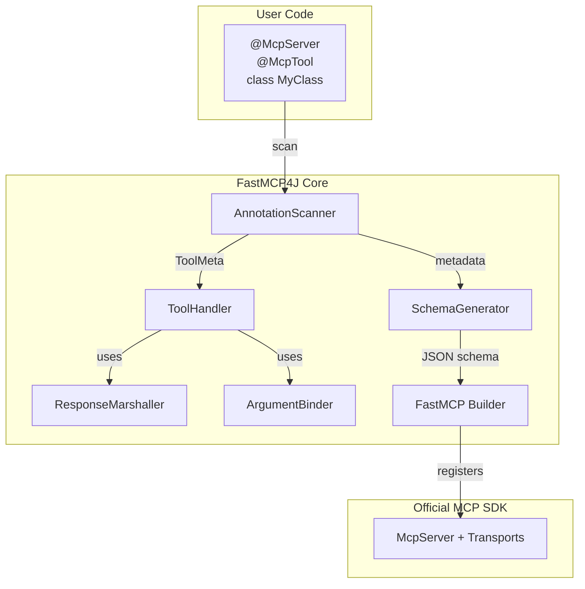
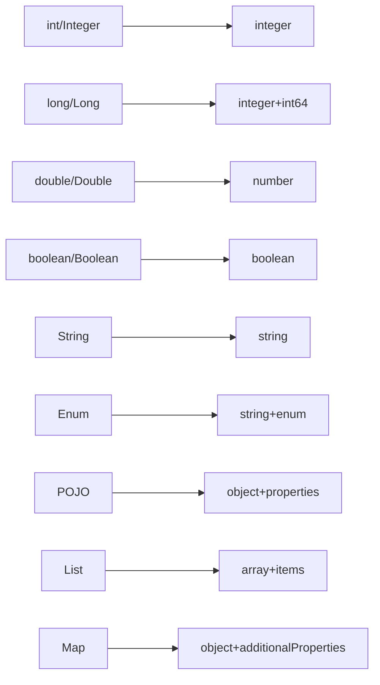
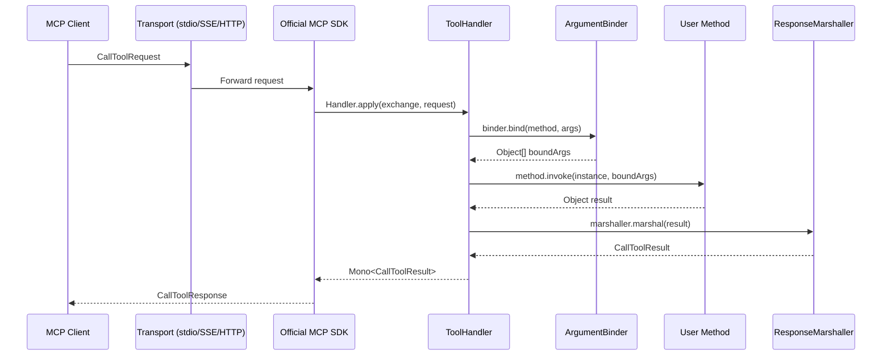

# FastMCP4J Architecture

## Motivation

FastMCP4J simplifies MCP server creation in Java from 30+ lines of verbose SDK code to ~10 lines using annotation-based APIs.

**Target Users**: Enterprise Java shops, microservice developers, backend engineers wrapping business logic as MCP tools.

**Goal**: Production-ready MCP servers with zero configuration—just annotate, run, done.

---

## High-Level Architecture



---

## Data Flow

```
User Annotated Class
        │
        ▼
┌──────────────────────┐
│  AnnotationScanner   │  Scans @McpServer, @McpTool, @McpResource, @McpPrompt
│                      │  Validates class structure
└──────────┬───────────┘
           │ ServerMeta, ToolMeta, ResourceMeta, PromptMeta
           ▼
┌──────────────────────┐
│   SchemaGenerator    │  Generates JSON schemas from method signatures
│                      │  Handles primitives, POJOs, collections, enums
└──────────┬───────────┘
           │ Map<String,Object> (JSON Schema)
           ▼
┌──────────────────────┐
│     FastMCP          │  Orchestrates all components
│      Builder         │  Creates McpServer via SDK
└──────────┬───────────┘
           │
           ▼
┌──────────────────────┐
│    Official MCP     │  Stdio, SSE, HTTP transports
│       SDK           │  Handles client communication
└──────────────────────┘
```

---

## Component Details

### 1. Annotations (`annotations/`)

| Annotation | Target | Purpose |
|------------|--------|---------|
| `@McpServer` | CLASS | Server metadata (name, version, instructions) |
| `@McpTool` | METHOD | Marks a method as an MCP tool |
| `@McpResource` | METHOD | Marks a method as an MCP resource |
| `@McpPrompt` | METHOD | Marks a method as an MCP prompt |
| `@McpAsync` | METHOD | Marker for async tools/resources/prompts |

### 2. Model (`model/`)

Immutable data classes (Lombok `@Value`):

- `ServerMeta` - Server configuration + all tools/resources/prompts
- `ToolMeta` - Tool name, description, method, async flag
- `ResourceMeta` - Resource URI, name, description, mimeType, method
- `PromptMeta` - Prompt name, description, method

### 3. Scanner (`scanner/`)

**AnnotationScanner** - Validates and extracts metadata:

```java
ServerMeta scan(Class<?> clazz)
  → validateServerClass()
  → scanTools() → List<ToolMeta>
  → scanResources() → List<ResourceMeta>
  → scanPrompts() → List<PromptMeta>
```

**ValidationException** - Thrown for:
- Missing `@McpServer`
- No no-arg constructor (top-level classes)

### 4. Schema Generator (`schema/`)

**SchemaGenerator** - Converts Java types to JSON Schema:

| Java Type | JSON Schema |
|-----------|-------------|
| `int`, `Integer` | `{"type": "integer"}` |
| `long`, `Long` | `{"type": "integer", "format": "int64"}` |
| `double`, `Double` | `{"type": "number"}` |
| `boolean`, `Boolean` | `{"type": "boolean"}` |
| `String` | `{"type": "string"}` |
| `Enum` | `{"type": "string", "enum": [...]}` |
| `POJO` | `{"type": "object", "properties": {...}}` |
| `List<T>` | `{"type": "array", "items": {...}}` |
| `Map<String, T>` | `{"type": "object", "additionalProperties": {...}}` |

**SchemaCache** - Caches generated schemas to avoid duplication

### 5. Adapters (`adapter/`)

**ToolHandler** - Bridges `ToolMeta` to MCP SDK handler:

```java
BiFunction<McpAsyncServerExchange, CallToolRequest, Mono<CallToolResult>>
  → ArgumentBinder.bind() → Object[]
  → Method.invoke() → Object result
  → ResponseMarshaller.marshal() → CallToolResult
```

**ArgumentBinder** - Binds JSON args to method parameters using Jackson

**ResponseMarshaller** - Converts method output to `CallToolResult`:
- Primitives/String → text content
- Objects → JSON string

### 6. Core (`core/`)

**FastMCP** - Fluent builder API:

```java
FastMCP.server(MyServer.class)
    .stdio()  // .sse() or .streamable()
    .build()  // → McpAsyncServer
    .run();   // Blocks until shutdown
```

**TransportType** - STDIO, HTTP_SSE, HTTP_STREAMABLE

---

## Type Mappings



---

## Execution Flow (Tool Call)



---

## Package Structure

```
io.github.fastmcp/
├── annotations/      # Runtime annotations for user code
├── model/           # Immutable metadata classes
├── scanner/         # Annotation scanning and validation
├── schema/          # JSON Schema generation
├── adapter/         # Handlers, binders, marshallers
├── core/            # FastMCP builder and transport types
└── exception/       # Custom exceptions
```

---

## Dependencies

```
io.modelcontextprotocol.sdk:mcp:0.16.0    # Official MCP SDK
com.fasterxml.jackson.core:jackson-databind   # JSON handling
org.projectlombok:lombok                    # Code generation
org.slf4j:slf4j-api + slf4j-simple          # Logging
org.junit.jupiter:junit-jupiter            # Testing
```

---

## Quick Example

```java
@McpServer(name = "Calculator", version = "1.0.0")
public class CalculatorServer {
    @McpTool(description = "Add two numbers")
    public int add(int a, int b) {
        return a + b;
    }

    public static void main(String[] args) {
        FastMCP.server(CalculatorServer.class)
            .stdio()
            .run();
    }
}
```

**What happens internally:**

1. `AnnotationScanner` scans class → `ServerMeta` with `ToolMeta`
2. `SchemaGenerator` generates schema → `{"type":"object","properties":{"a":{"type":"integer"},"b":{"type":"integer"}}}`
3. `ToolHandler` wraps method as SDK handler
4. `FastMCP` registers with official SDK
5. Client calls `add` → args bound → method invoked → result marshalled → response sent
