<div align="center">

# FastMCP4J

[](https://central.sonatype.com/artifact/io.github.terseprompts.fastmcp/fastmcp-java)
[](https://openjdk.org/)
[](https://github.com/tersePrompts/fastMCP4J/actions/workflows/test.yml)
[](LICENSE)
[](src/test/java)
[](https://getlulu.dev/mcps)

**Annotate a Java class. Ship an MCP server.**

Tools, resources, prompts, memory — and a sandboxed bash terminal that can't
touch your machine. No boilerplate, no containers, no 50-jar framework.

**[AI Agents →](.claude/skill/fastmcp4j/skill.md)** Share this skill with Claude for code generation

</div>

<p align="center">
  
</p>

FastMCP4J is an annotation-driven SDK for the
[Model Context Protocol](https://modelcontextprotocol.io) (spec 2.0.1) on
Java 17+. One annotation turns a class into an MCP server; one more gives your
AI agent a real terminal — **a bash sandbox where the host is unreachable by
construction**. Cold start in under 500 ms, twelve dependencies, everything
testable in-process.

> **Status**: beta (v0.5.0-beta) — API stable, 235 tests passing, published to
> [Maven Central](https://central.sonatype.com/artifact/io.github.terseprompts.fastmcp/fastmcp-java).

---

## Quick start (2 minutes)

**Maven**

```xml
<dependency>
    <groupId>io.github.terseprompts.fastmcp</groupId>
    <artifactId>fastmcp-java</artifactId>
    <version>0.5.0-beta</version>
</dependency>
```

**Gradle**

```groovy
implementation 'io.github.terseprompts.fastmcp:fastmcp-java:0.5.0-beta'
```

That's the whole install story: **Java 17+**, one artifact on Maven Central,
MCP Java SDK 2.0.1 underneath. No annotation processor, no codegen step, no
container runtime.

### Create your server

```java
@McpServer(name = "Assistant", version = "1.0")
public class MyAssistant {

    @McpTool(description = "Summarize text")
    public String summarize(@McpParam(description = "Text") String text) {
        return "Summary: " + text.substring(0, Math.min(100, text.length()));
    }

    public static void main(String[] args) {
        FastMCP.server(MyAssistant.class)
            .stdio()           // or .sse() or .streamable()
            .run();
    }
}
```

```bash
mvn exec:java -Dexec.mainClass="com.example.MyAssistant"
```

**That's it. Your MCP server is running.**

**Working example**: [EchoServer.java](https://github.com/tersePrompts/fastMCP4J/blob/main/src/test/java/io/github/terseprompts/fastmcp/example/EchoServer.java)

---

## Why this exists

Every Java team wiring AI agents to tools faces the same choice, and every
option hurts:

| | Raw MCP SDK | Spring AI / LangChain4j | **FastMCP4J** |
|---|---|---|---|
| Lines per tool | 35+ | varies, plus framework glue | **~8** |
| Dependencies | 1 + your patience | 30–50+ jars | **12 jars** |
| Startup | fast | framework-sized | **<500 ms, ~64 MB** |
| Sandboxed bash | roll your own | not included | **✅ built-in (bashkit4j)** |
| Built-in memory / todo / planner / file tools | no | no | **✅ one annotation each** |
| Lock-in | none | framework | **none — MCP in, MCP out** |

> **Before:** a day of JSON-schema plumbing per tool, and shell access means a
> rogue prompt is a node down.
> **After:** annotations on Tuesday, agents in production Wednesday — and the
> terminal they use can't touch your disk.

---

## The API tour

### 1 · Make a tool — sync or async

```java
@McpTool(description = "Add two numbers")
public int add(int a, int b) {
    return a + b;
}

@McpTool(description = "Process data")
@McpAsync  // ← just add this; return Mono<?>
public Mono<String> process(@McpContext Context ctx, String input) {
    return Mono.fromCallable(() -> {
        ctx.reportProgress(50, "Processing...");
        return slowOperation(input);
    });
}
```

### 2 · Built-in brains — one annotation each

```java
@McpServer(name = "MyServer", version = "1.0")
@McpMemory     // AI remembers things across sessions
@McpTodo       // AI manages tasks
@McpPlanner    // AI breaks work into plans
@McpFileRead   // AI reads your files
@McpFileWrite  // AI writes files
public class MyServer {
    // complete tool sets enabled, zero implementation
}
```

| Annotation | Tools you get |
|------------|---------------|
| `@McpMemory` | list, read, create, replace, insert, delete, rename |
| `@McpTodo` | add, list, updateStatus, updateTask, delete, clearCompleted |
| `@McpPlanner` | createPlan, listPlans, getPlan, addTask, addSubtask |
| `@McpFileRead` | readLines, readFile, grep, getStats |
| `@McpFileWrite` | writeFile, appendFile, writeLines, deleteFile, createDirectory |

### 3 · Sandboxed bash — give the agent a terminal, not your machine

```java
@McpServer(name = "Reviewer", version = "1.0")
@McpBash(
    allowMountsUnder = "C:/dev",           // opt in: all it may ever see
    mounts = {"/project=C:/dev/my-app"},   // mount the project — read-only
    timeout = 30, maxCommands = 10_000     // bounds runaway scripts
)
public class Reviewer { }
```

Scripts run in a [bashkit4j](https://github.com/tersePrompts/bashkit4j)
in-memory sandbox: POSIX-style bash with 160+ commands re-implemented
natively, a virtual filesystem, network denied by default. **No real bash is
ever spawned.** Then the agent calls the `bash` tool:

```
grep -rn TODO /project/src | head -5      # real files, zero risk
echo "findings..." > /notes.md            # writes stay in the sandbox
```

| | Host shell (`ProcessBuilder`, Docker) | **Sandbox mode** |
|---|---|---|
| Real bash on the host | ✅ runs — full attack surface | **❌ never — bash re-implemented natively** |
| Host filesystem visible | ✅ all of it | **❌ invisible until you mount, read-only by default** |
| OS processes per command | ✅ one per call | **❌ zero — in-process** |
| Network access | ✅ open | **❌ denied by default** |
| One rogue script | node down | **sandbox reset** |

State persists across calls (cwd, env, files) — multi-step agent workflows
work. Mounts are enforced inside the native library: canonicalized,
symlink-safe, and impossible without `allowMountsUnder`. Need the real shell
for trusted automation? `mode = BashMode.HOST` keeps the legacy tool with its
path guardrails.

> Sandbox mode requires the optional
> `io.github.terseprompts:bashkit4j:0.2.0` dependency — native libs for
> Windows/Linux/macOS (x86-64 + ARM64) are bundled and auto-detected.

> **🔭 Future scope — a third mode, `BashMode.DOCKER`.** The isolation ladder
> gets one more rung: `HOST` = the full computer (trusted use) → `SANDBOX` =
> a virtual computer, no real code execution (default) → **`DOCKER`** = real
> bash inside a per-session container jail. The sketch: one container per MCP
> session, lazy-created and hardened at run (`--network none --memory 512m
> --cpus 1 --pids-limit 64 --security-opt no-new-privileges --read-only
> --tmpfs /tmp`); the command passed as a single argv element (no host-shell
> interpolation → no injection surface); the timeout enforced *inside* the
> container so the wall-clock survives a server crash; named exit codes
> (`[exit 124: timed out]`, `[exit 137: OOM]`), capped output, idle-TTL
> eviction with a reaper backstop — containers stay stateless, durable state
> lives only in the mounted worktree. Config stays env-only
> (`FASTMCP_DOCKER_IMAGE`, timeout). Not started — see
> [Roadmap](ROADMAP.md); help wanted.

### 4 · Pick a transport

```java
FastMCP.server(MyServer.class)
    .stdio()       // CLI tools, local agents
    .sse()         // web clients, long-lived connections
    .streamable()  // bidirectional streaming (recommended)
    .run();
```

```java
FastMCP.server(MyServer.class)
    .port(3000)                              // HTTP port
    .requestTimeout(Duration.ofMinutes(5))   // request timeout
    .keepAliveSeconds(30)                    // keep-alive interval
    .capabilities(c -> c
        .tools(true)
        .resources(true, true)
        .prompts(true))
    .run();
```

### 5 · Resources & prompts

```java
@McpResource(uri = "config://settings")
public String getSettings() {
    return "{\"theme\": \"dark\"}";
}

@McpPrompt(name = "code-review")
public String codeReviewPrompt(@McpParam(description = "Code to review") String code) {
    return "Review this code:\n" + code;
}
```

### 6 · Hooks — before/after every tool call

```java
// Run before ALL tools (*)
@McpPreHook(toolName = "*", order = 1)
void authenticate(Map<String, Object> args) {
    String token = (String) args.get("token");
    if (!isValid(token)) throw new SecurityException("Unauthorized");
}

// Run after a specific tool only
@McpPostHook(toolName = "calculate", order = 1)
void logResult(Map<String, Object> args, Object result) {
    System.out.println("Result: " + result);
}
```

- `toolName` — target tool, or `"*"` for all (empty = inferred from method name)
- `order` — execution priority, lower runs first (default `0`)
- Pre-hooks receive the arguments; post-hooks receive arguments + result

### 7 · Request context

```java
@McpTool(description = "Read file with auth")
public String readFile(@McpContext Context context, String path) {
    context.info("Reading file: " + path);
    String auth = context.getRequestHeaders().get("Authorization");
    // ...
}
```

`Context` gives you `getClientId()`, `getSessionId()`, `getToolName()`,
`getRequestHeaders()`, `info`/`warning`/`error` logging, `reportProgress`,
`listResources()`, `listPrompts()`.

### 8 · Organize at scale

```java
// explicit modules
@McpServer(name = "MyServer", version = "1.0",
    modules = {StringTools.class, MathTools.class})

// or package scanning
@McpServer(name = "MyServer", version = "1.0",
    scanBasePackage = "com.example.tools")
```

### 9 · Icons & telemetry

```java
@McpServer(
    name = "my-server",
    icons = {"data:image/svg+xml;base64,...:image/svg+xml:64x64:light"}
)
@McpTelemetry(enabled = true, exportConsole = true, sampleRate = 1.0)
public class MyServer { }
```

Telemetry collects tool invocation counters, duration histograms, and error
rates — console or OpenTelemetry export.

---

## Annotations reference

| Annotation | Target | Purpose |
|------------|--------|---------|
| `@McpServer` | TYPE | Define your MCP server |
| `@McpTool` | METHOD | Expose as callable tool |
| `@McpResource` | METHOD | Expose as resource |
| `@McpPrompt` | METHOD | Expose as prompt template |
| `@McpParam` | PARAMETER | Description, examples, constraints, defaults |
| `@McpAsync` | METHOD | Make tool async (return `Mono<?>`) |
| `@McpContext` | PARAMETER | Inject request context |
| `@McpPreHook` / `@McpPostHook` | METHOD | Run code before/after tool calls |
| `@McpBash` | TYPE | Bash tool — sandboxed (default) or host shell via `mode` |
| `@McpTelemetry` | TYPE | Metrics and tracing |
| `@McpMemory` / `@McpTodo` / `@McpPlanner` | TYPE | Built-in tool sets |
| `@McpFileRead` / `@McpFileWrite` | TYPE | Built-in file tools |

**@McpParam advanced options:**

```java
@McpTool(description = "Create task")
public String createTask(
    @McpParam(
        description = "Task name",
        examples = {"backup", "sync"},
        constraints = "Cannot be empty",
        defaultValue = "default",
        required = false
    ) String taskName
) { return "Created: " + taskName; }
```

---

## What the sandbox actually does (measured, not claimed)

FastMCP4J ships **235 tests** (`mvn test`) — the sandbox suite runs against
the real native library on Windows and Linux CI, including deliberate escape
probes:

| Probe | Result |
|---|---|
| `ls /` inside the sandbox | virtual root only — `pom.xml`, `target`, host paths absent |
| `whoami` / `hostname` | `agent@sandbox` — virtual identity, not your OS user |
| Write to a read-only mount | fails; host file provably never appears |
| Read-write mount | round-trips to the host through the Java API |
| `cd` + file across tool calls | persists inside a server; sealed between servers |
| Script exceeding timeout | caller gets `TIMEOUT`; sandbox replaced fresh for next call |
| 4 concurrent tool calls | all complete — calls serialize on the sandbox |
| Sandbox without `bashkit4j` on classpath | clear startup error naming the dependency |

---

## Who it's for

- **AI/LLM engineers** — expose Java services to Claude, Cursor, or any MCP
  client with annotation-level effort.
- **Teams shipping agent tools** — memory, todo, planning, file access, and a
  sandboxed terminal out of the box; hooks and telemetry for production.
- **Security-conscious platforms** — agent terminal access with the host
  unreachable by construction, not by prompt-engineering.
- **Existing Spring/DI codebases** — drop-in server, no framework lock-in;
  your beans become tools with an annotation.

---

## Requirements & performance

Just **Java 17+** and Maven 3.8+. MCP spec 2.0.1 via the official Java SDK
(`mcp-core` + `mcp-json-jackson2`).

- Cold start: <500 ms
- Tool invocation: <5 ms
- Memory: ~64 MB
- Purpose-built for MCP — not a general AI framework

---

## CI/CD

| Branch | What runs |
|--------|-----------|
| `development` (staging) | Full test suite + MCP integration tests (STDIO / SSE / Streamable / **Sandboxed Bash**) on every push and PR |
| `main` | Same suite + **publish to Maven Central** (staged; manual approval in [Sonatype Central](https://central.sonatype.com/deployments)) |

Flow: feature branch → `development` → `main` (release).

---

## Documentation

- [Architecture](ARCHITECTURE.md) — how it works
- [Roadmap](ROADMAP.md) — what's next
- [Contributing](CONTRIBUTING.md) — PRs welcome
- [Changelog](CHANGELOG.md) — version history
- [Claude Skill](.claude/skill/fastmcp4j/skill.md) — for AI agents

---

## License

[MIT](LICENSE) © 2026

---

<div align="center">

**Less boilerplate. More shipping.**

[Get started](#quick-start-2-minutes) • [Examples](https://github.com/tersePrompts/fastMCP4J/blob/main/src/test/java/io/github/terseprompts/fastmcp/example/EchoServer.java) • [Docs](#documentation)

Made with ❤️ for the Java community

</div>
